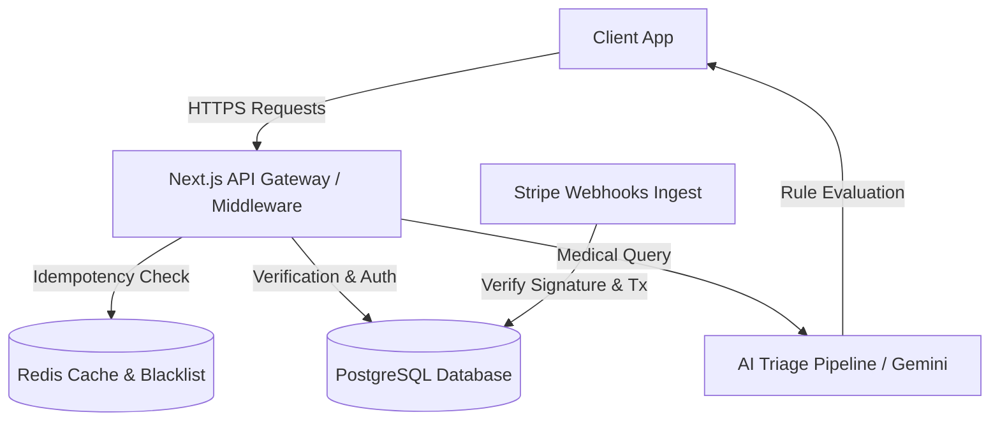

# Health Portal System Architecture & DevOps Guide

This document describes the high-level system architecture, security designs, and environment setups for the Health Portal.

---

## 1. System Architecture Diagram & Data Flow



---

## 2. Zero-Trust Security Architecture

### A. Column-Level Encryption (CLE)

- **Algorithm**: AES-256-GCM (Galois/Counter Mode) with a unique initialization vector (IV) per record write.
- **Fields Encrypted**: `ssn`, `contactInfo`, and `medicalHistory` in the `PatientRecord` table.
- **Master Key Requirements**: The system requires a `MASTER_KEY` environment variable on boot. It must be:
  - A 64-character hexadecimal string representing exactly 32 bytes (256 bits) of entropy.
  - If the key is missing or does not meet these criteria, the server logs a fatal error and terminates immediately.
- **Implementation**: Handled transparently by Prisma Client extensions (`src/lib/prisma.ts`), automatically encrypting on writes (`create`, `update`, `upsert`) and decrypting on reads (`findUnique`, `findMany`, etc.).

### B. Dual-Token Authentication Strategy

1. **Access Token**:
   - Short-lived (300 seconds / 5 minutes validity).
   - Stored purely in-memory on the client application to prevent XSS exfiltration.
2. **Refresh Token**:
   - Long-lived (7 days validity).
   - Stored in a secure cookie with flags: `HttpOnly`, `Secure`, `SameSite=Strict`.
   - Signed with a unique identifier (`jti`) and a dedicated secret `JWT_REFRESH_SECRET`.

### C. Redis Token Revocation & Anomalous Session Invalidations

- On logout, password reset, or anomaly detection:
  1. The `jti` claim is extracted from the refresh token.
  2. The `jti` is stored in Redis as a revoked identifier with a TTL matching the token's remaining lifespan.
  3. Subsequent refresh requests inspect Redis; if the `jti` is blacklisted, the request is rejected with `HTTP 401 Unauthorized` and cookies are cleared.

---

## 3. Payment Processing Layer

### A. Global Idempotency Middleware

- All state-modifying requests (`POST`, `PUT`, `PATCH`) must supply a UUIDv4 `X-Idempotency-Key` header.
- **Race Condition Protection**: A distributed Redis lock is acquired using the key on entry (30-second lock window). If another request arrives with the same key before completion, it is rejected with `HTTP 409 Conflict`.
- **Response Caching**: On successful request execution, the HTTP status, headers, and response payload are cached in Redis with a 24-hour TTL. Duplicate requests are served directly from the cache with the `X-Cache-Lookup: HIT` header.

### B. Cryptographical Webhook Verification

- Webhooks from Stripe (`/api/payments/webhook`) are cryptographically verified using the provider's SDK against `STRIPE_WEBHOOK_SECRET`.
- **Replay Attack Mitigation**: Signature timestamp validity is strictly capped at 5 minutes.
- **Transaction Safety**: Status updates are wrapped in an atomic database transaction. If the transaction fails, the endpoint returns `HTTP 500` to trigger Stripe retries.

---

## 4. AI Safety Triage Pipeline

### A. Input Sanitization & Prompt Injection Shielding

- Queries are scanned for known prompt injection keywords ("ignore instructions", "bypass guidelines", "act as a doctor"). Requests violating these rules are instantly rejected.

### B. XML Prompt Isolation

- Clinical rules and guidelines are hardcoded in the system instructions wrapped in `<clinical_guidelines>` XML tags.
- Patient queries are isolated and sanitized under the `<patient_input>` tag.

### C. Output Forcing & Middleware Disclaimer

- Gemini API is configured to return strictly structured JSON matching the Zod schema:
  `{ "triage_level": "low" | "medium" | "high", "summary": "string", "requires_doctor": boolean, "disclaimer": "string" }`
- **Output Middleware**: If `requires_doctor` is true or emergency keywords are flagged, the middleware automatically appends an unalterable, strict legal disclaimer.

---

## 5. Cold-Start Setup Instructions

Follow these steps to spin up the entire development environment from scratch:

### Step 1: Clone and Install Dependencies

```bash
npm install
```

### Step 2: Spin Up Services using Docker Compose

Run the orchestrator. This will start PostgreSQL, Redis, generate your environment secrets, and push the database schema:

```bash
docker-compose up --build
```

### Step 3: Run the Test Suite and Linters

To execute tests locally:

```bash
npm test
```

To run the strict linter:

```bash
npm run lint
```
